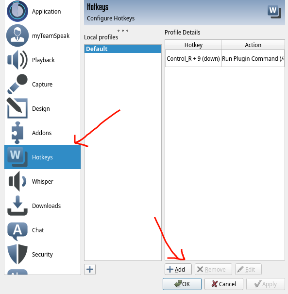
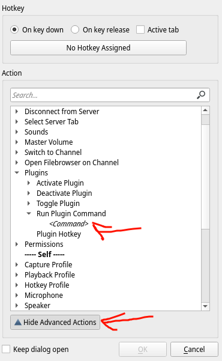

# TS3 Plugin

This is a simple plugin that provides a command for sending messages in the current channel, nothing more, nothing less.

# How to use

You can simply write `/chanmsg <Message>` in order to write a message in the current channel, but the plugin was made with a different purpose in mind.

You can add the command as an hotkey.

In TeamSpeak open the Options Menu and go to hotkey, then add an hotkey, click on Show Advanced Actions and click Server -> Plugins -> Run Plugin Command -> <Command>  there you must insert the full command `/chanmsg <Message>`.

